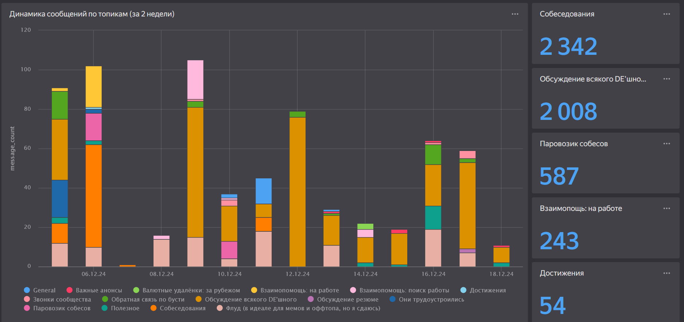
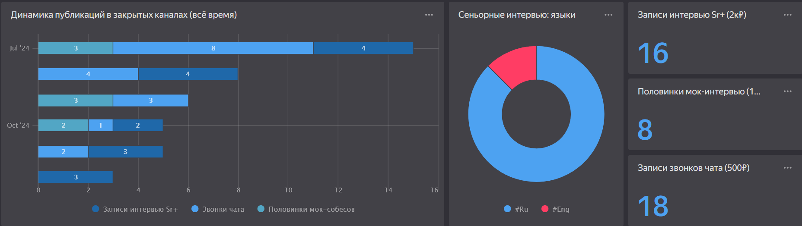
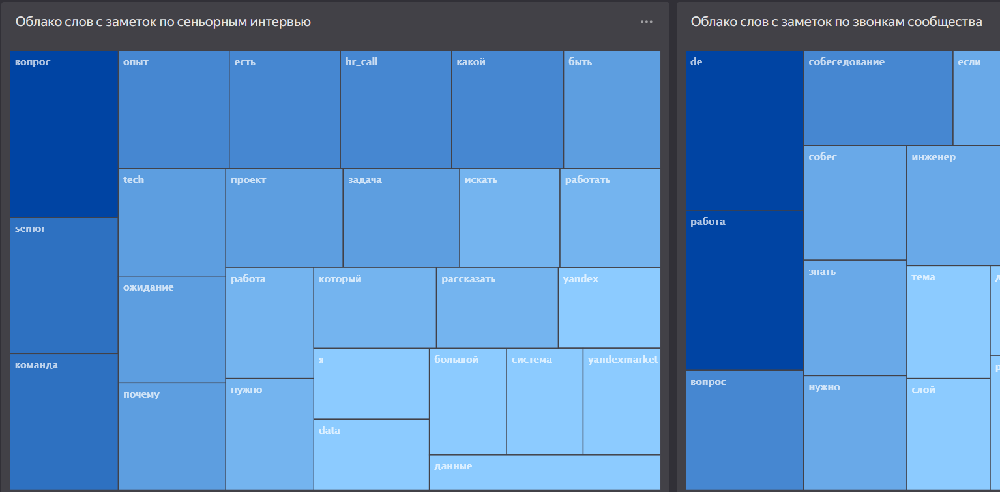

# 🤖 rzv_de TG Stats Dashboard Bot (boosty, patreon)

Ever wondered what's happening in your Telegram channels and chats but got tired of manual tracking? Meet TG Stats Dashboard Bot - your friendly neighborhood statistics collector that turns Telegram data into neat Google Sheets dashboards. 

100% Free, hosting included. Made for content creators who use private telegram chats and channels and want to show what's behind the paywall.

Example (ru) for the https://boosty.to/rzv_de data engineering community. Click the link and try yourself:

---> [Datalens BI dashboard](https://datalens.yandex/vhix6u25akgwi) <---





## 🎯 What's This?

This bot is your Swiss Army knife for Telegram analytics, designed for community managers, content creators, and data enthusiasts who want to:
- Show how much content do you have behind the paywall (for Boosty, Patreon etc)
- Track channel growth
- Monitor chat activity patterns
- Analyze content performance
- Build custom dashboards without coding

Unlike official Telegram analytics, this tool gives you raw data in Google Sheets, letting you slice and dice it however you want. Plus, it works with private channels and tracks way more metrics!

## 🚀 Features

### Core Features
- 📈 **Channel Analytics**
  - Member count tracking
  - Message volume monitoring
  - Hashtag usage analysis
  - Word frequency tracking

- 💬 **Chat Insights**
  - Topic activity monitoring
  - Message distribution by hour
  - User engagement patterns

### Technical Highlights
- 🔄 **Automated Collection**
  - GitHub Actions integration for scheduled runs
  - Configurable collection intervals
  - Cache system for reliable data gathering
  - Progress tracking with detailed logging

- 📊 **Data Processing**
  - Word normalization (supports English and Russian)
  - Smart deduplication
  - Rate limit-aware collection

- 🛡️ **Privacy & Security**
  - Uses your own Telegram account (no bot token needed)
  - Private channel support
  - Masked channel IDs in logs
  - Onlly processed content storage (normalized or aggregated)


## ⚙️ Setup Guide

### Prerequisites
- Python 3.10 or higher
- Google account with access to Google Cloud Console
- Telegram account (no bot token needed!)
- Basic familiarity with command line
- ~50MB of disk space

### Step 1: Basic Setup
```bash
# Clone the repository
git clone https://github.com/yourusername/tg-stats-dashboard-bot.git
cd tg-stats-dashboard-bot

# Create and activate virtual environment
python -m venv venv
source venv/bin/activate  # Linux/MacOS
venv\Scripts\activate     # Windows

# Install dependencies
pip install -r requirements.txt
```

### Step 2: Telegram Configuration

#### Getting API Credentials
1. Visit https://my.telegram.org/apps
2. Log in with your phone number
3. Create new application if you don't have one
4. Save your `api_id` and `api_hash` - you'll need these later

#### Creating Session String
This is a bit tricky but super important - we need to create a special session string that lets the bot access Telegram using your account:

```python
# Run this in Python console
from telethon.sessions import StringSession
from telethon.sync import TelegramClient

api_id = 123456  # Your api_id here
api_hash = "your_api_hash_here"

with TelegramClient(StringSession(), api_id, api_hash) as client:
    print(client.session.save())
```

You'll be asked to:
1. Enter your phone number
2. Input the verification code sent to your Telegram
3. Provide 2FA password if enabled

Save the long string that's printed - this is your session string!

### Step 3: Google Sheets Setup

#### Creating Google Cloud Project
1. Go to [Google Cloud Console](https://console.cloud.google.com/)
2. Create a new project (or select existing)
3. Enable Google Sheets API:
   - Navigate to "APIs & Services" > "Library"
   - Search for "Google Sheets API"
   - Click "Enable"

#### Setting Up Service Account
1. Go to "IAM & Admin" > "Service Accounts"
2. Click "Create Service Account"
3. Fill in the details:
   - Name: e.g., "tg-stats-bot"
   - Role: No role needed
4. Click "Create and Continue"
5. Click "Done"
6. Find your new service account in the list
7. Create key:
   - Click on the service account
   - Go to "Keys" tab
   - "Add Key" > "Create new key"
   - Choose JSON
   - Download the file (keep it safe!)

#### Preparing Google Sheet
1. Create a new Google Sheet
2. Share it with the service account email (found in your JSON file)
3. Copy the sheet URL - you'll need it for configuration

### Step 4: Environment Configuration

Create `.env` file in the project root:
```bash
TELEGRAM_API_ID=your_api_id
TELEGRAM_API_HASH=your_api_hash
TG_SESSION="your_session_string"

# Channels to track - format is important!
TELEGRAM_CHANNELS={"channels":["https://t.me/channel1","https://t.me/+invite_link2"],"chats":["https://t.me/chat1"]}

# Google configuration
GOOGLE_SHEET_URL=your_sheet_url
GOOGLE_CREDENTIALS_PATH=path_to_your_downloaded.json

# Other settings
TIMEZONE=Europe/Moscow
MODE=regular  # or 'backfill' for historical data
```

Pro Tips:
- For private channels, use invite links in the TELEGRAM_CHANNELS config
- Make sure you're a member of all channels/chats you want to track
- Keep your credentials file secure - never commit it to git!


## 📊 Output & Data Structure

The bot creates several sheets in your Google Spreadsheet, each serving a specific purpose:

### channels_daily
```
Key columns: channel_id, date
Data: channel_name, member_count, messages_count
Updated: Daily rewrite
```
Is used to store current total number of members and messages. Does not store history (yet).

### channel_messages
```
Key columns: channel_id, message_id, word
Data: message date, normalized words
Updated: Every run
```
Great for content analysis:
- Most used words
- Topic trends
- Content patterns
- Language analysis

### chat_topics_hourly
```
Key columns: chat_id, topic_id, hour
Data: topic_name, message_count, first/last message IDs
Updated: Hourly aggregation
```
Perfect for forum-style chats:
- Topic popularity
- Discussion peaks
- Activity heatmaps

### hashtags_detailed
```
Key columns: channel_id, message_id, hashtag
Data: usage date, hashtag text
Updated: Every run
```
Track hashtag performance:
- Popular tags
- Usage patterns
- Campaign tracking
- Content categorization

## 🛠️ Deployment Options

### Local Run
Quick start for testing or one-off collection:
```bash
python -m src.main
```

### GitHub Actions (Recommended)
For automated collection, use the included GitHub Actions workflow:

1. Fork this repository
2. Add these repository secrets:
   ```
   TELEGRAM_API_ID
   TELEGRAM_API_HASH
   TELEGRAM_CHANNELS
   GOOGLE_SHEET_URL
   GOOGLE_CREDENTIALS (entire JSON content)
   TG_SESSION
   ```
3. Enable Actions in your repository
4. The bot will run automatically twice daily (can be customized in `.github/workflows/stats.yml`)


## ⚠️ Limitations & Known Issues

### Telegram API Limits
- ⏱️ Rate limits may slow down collection
- 📱 Phone number verification required initially

### Data Collection
- 📊 No historical data beyond available messages
- 🔄 Message edits might be missed
- 🗑️ Deleted messages not tracked

### Technical
- 🔑 Requires user account (not bot)
- 📈 Google Sheets row limit (5M per sheet)
- ⚡ RAM usage scales with channel count


## 🤝 Contributing

### Found a Bug?
1. Check existing issues first
2. Use the bug report template
3. Include:
   - Your Python version
   - Complete error traceback
   - Steps to reproduce
   - Expected vs actual behavior

### Feature Requests
1. Open an issue with 'enhancement' label
2. Describe the feature and its value
3. Provide use cases if possible

### Pull Requests
We love PRs! Here's how to make them awesome:

1. Fork the repo
2. Create a feature branch
   ```bash
   git checkout -b feature/amazing-feature
   ```
3. Make your changes
4. Add tests if applicable
5. Update documentation
6. Submit PR with detailed description

Code Style:
- Follow PEP 8
- Use meaningful variable names
- Add comments for complex logic
- Keep functions focused and small

### Development Setup
```bash
# Fork and clone your fork
git clone https://github.com/yourusername/tg-stats-dashboard-bot.git
cd tg-stats-dashboard-bot

# Create development environment
python -m venv venv
source venv/bin/activate  # Linux/MacOS
venv\Scripts\activate     # Windows

# Install dev dependencies
pip install -r requirements.txt
pip install black flake8 pytest  # Development tools

# Create branch for your feature
git checkout -b feature/your-amazing-feature

# Happy coding! 🎉
```

## 📝 License

This project is licensed under the MIT License.

---

Made with ❤️ by [Razvodov Aleksei](https://t.me/razvodov_de_mentor). Star ⭐ if you find it useful!

Need help? Open an issue or join our discussions!